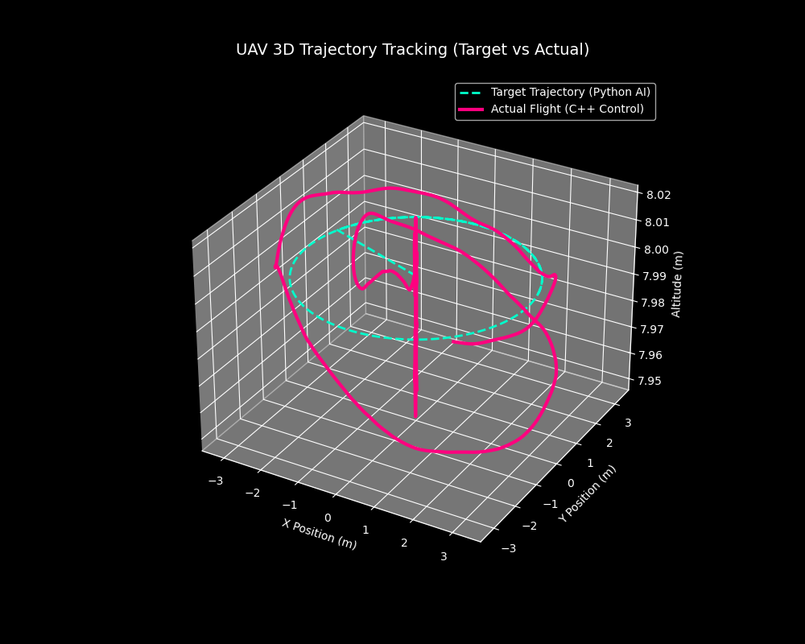

# 🛸 ROS2 Multi-UAV Trajectory Execution & Analysis System

### 基于 ROS2 与 DDS 架构的多无人机轨迹控制与数据闭环验证系统

本系统是一个基于 **Ubuntu 24.04 + ROS2 Jazzy + PX4 SITL** 的高保真多无人机协同测试床。项目摒弃了传统的 MavROS 架构，采用原生 **Micro XRCE-DDS** 桥接底层飞控，实现了高层 AI 轨迹生成（Python）与底层高鲁棒性执行控制（C++）的软硬解耦。系统内置完整的“仿真-采集-渲染-量化”数据闭环，为深度学习轨迹预测与多机协同规划算法提供可靠的 Baseline（基线）验证环境。

## ✨ 核心工程特性 (Core Features)

* **🚀 原生 DDS 架构与命名空间隔离**
  * 彻底移除 MavROS 依赖，通过 Micro XRCE-DDS 实现低延迟底层穿透。完美解决多机协同（Swarm）场景下的 ROS2 节点命名空间冲突与 Topic 串扰问题。
* **🧠 软硬解耦的云边协同架构**
  * **高层算法（Python）**：专注高频生成动态 3D 目标坐标（支持后续接入神经网络预测模型）。
  * **底层执行（C++）**：黑盒化处理 Offboard 模式心跳、解锁、起飞及状态机管理，保障飞行器绝对安全。
* **🛡️ 动态滤波与平滑防撞控制 (Dynamic Low-Pass Filtering)**
  * 针对阵型切换与 AI 突变指令极易引发的物理冲激与过载问题，在 C++ 执行端自主设计并引入一阶低通滤波策略。
  * 根据当前飞行状态动态调整平滑系数（`alpha`），在“静态变阵的绝对平滑性”与“动态追踪的敏捷响应”间取得绝佳的工程平衡。
* **📊 全链路数据闭环与高保真重建**
  * 利用 `rosbag2` 实时捕获飞控底层真实里程计（`vehicle_odometry`）数据，脱离物理引擎限制，通过离线 Python 脚本完成 3D 轨迹的高保真渲染与时空误差量化。

## 📈 性能量化与瓶颈分析 (Performance & Evaluation)

本系统完成了严苛的动态追踪测试（2m/s 绕圆机动），并通过提取黑匣子数据生成了如下的 3D 轨迹追踪对比图：



*(注：青色虚线为 Python 端生成的理论 AI 轨迹，粉色实线为 C++ 端驱动飞控执行的真实物理轨迹)*

**量化指标 (Metrics)：**
* **最大瞬态误差 (Max Error):** `3.461 m` (主要发生于初始变阵与起飞爬升阶段)
* **稳态均方根误差 (RMSE):** `1.536 m`

**🔬 架构瓶颈与后续迭代方向 (Future Work)：**
当前的 1.536m 稳态误差精准暴露了**“纯位置指令追踪（Pure Position Tracking）”**系统的固有相位滞后（Phase Lag）物理瓶颈。这验证了系统的高保真度，同时也确立了精确的 Baseline。下一步将引入**深度学习时序预测模型**或**速度/加速度前馈（Feedforward）**机制，提前补偿物理惯性与通信延迟，进一步压低稳态追踪误差。

## ⚙️ 环境依赖与快速复现 (Dependencies & Quick Start)

### 1. 系统与依赖
* 操作系统: `Ubuntu 24.04`
* 核心中间件: `ROS2 Jazzy` + `Micro XRCE-DDS Agent`
* 仿真环境: `PX4 Autopilot` (SITL + Gazebo)
* Python 依赖: `pandas`, `matplotlib`, `numpy`

### 2. 编译与运行逻辑
本项目为多节点分布式系统，需依次拉起仿真世界与控制大脑：

```bash
# 1. 编译自定义控制节点
cd ~/ros2_ws
colcon build --packages-select px4_swarm_controller
source install/local_setup.bash

# 2. 启动底层通信桥梁与 PX4 物理仿真
MicroXRCEAgent udp4 -p 8888
cd ~/PX4-Autopilot && ./start_swarm.sh

# 3. 启动 C++ 执行器与 Python 算法中枢
ros2 launch px4_swarm_controller launch_simulation.py
python3 swarm_commander.py
## ✨ 核心工程特性 (Core Features)
      🛸 5 机集群分布式协同与动态变阵 (Swarm Formation Control)
      * 在单机高精度追踪的基础上，系统成功扩展至 5 机分布式控制。利用 ROS2 订阅发布机制与空间相位差计算，实现了集群从地面起飞、空中悬停到 V字形 与 环形 阵型的无碰撞动态切换，验证了系统在多并发节点下的算力调度与通信稳定性。
  * **🚀 原生 DDS 架构与命名空间隔离**
      * 移除 MavROS 依赖，通过 Micro XRCE-DDS 实现低延迟底层穿透。完美解决多机协同（Swarm）场景下的 ROS2 节点命名空间冲突与 Topic 串扰问题。
  * **🧠 软硬解耦的云边协同架构**
      * **高层算法（Python）**：专注高频生成动态 3D 目标坐标（支持后续接入神经网络预测模型）。
      * **底层执行（C++）**：黑盒化处理 Offboard 模式心跳、解锁、起飞及状态机管理，保障飞行器绝对安全。
  * **🛡️ 动态滤波与平滑防撞控制 (Dynamic Low-Pass Filtering)**
      * 针对阵型切换与 AI 突变指令极易引发的物理冲激与过载问题，在 C++ 执行端自主设计并引入一阶低通滤波策略。
      * 根据当前飞行状态动态调整平滑系数（`alpha`），在“静态变阵的绝对平滑性”与“动态追踪的敏捷响应”间取得绝佳的工程平衡。
  * **📊 全链路数据闭环与高保真重建**
      * 利用 `rosbag2` 实时捕获飞控底层真实里程计（`vehicle_odometry`）数据，脱离物理引擎限制，通过离线 Python 脚本完成 3D 轨迹的高保真渲染与时空误差量化。
## 📈 性能量化与瓶颈分析 (Performance & Evaluation)

本系统完成动态追踪测试（2m/s 绕圆机动），并通过提取黑匣子数据生成了如下的 3D 轨迹追踪对比图：
*(注：青色虚线为 Python 端生成的理论 AI 轨迹，粉色实线为 C++ 端驱动飞控执行的真实物理轨迹)*
**量化指标 (Metrics)：**
  * **最大瞬态误差 (Max Error):** `3.461 m` (主要发生于初始变阵与起飞爬升阶段)
  * **稳态均方根误差 (RMSE):** `1.536 m`
**🔬 架构瓶颈与后续迭代方向 (Future Work)：**
当前的 1.536m 稳态误差精准暴露了\*\*“纯位置指令追踪（Pure Position Tracking）”**系统的固有相位滞后（Phase Lag）物理瓶颈。这验证了系统的高保真度，同时也确立了精确的 Baseline。下一步将引入**深度学习时序预测模型**或**速度/加速度前馈（Feedforward）\*\*机制，提前补偿物理惯性与通信延迟，进一步压低稳态追踪误差。
## 🛠️ 技术栈 (Tech Stack)
  * **OS**: Ubuntu 24.04 LTS
  * **Middleware**: ROS2 Jazzy, eProsima Micro XRCE-DDS
  * **Flight Controller**: PX4 Autopilot (SITL / Gazebo)
  * **Data & Visualization**: PlotJuggler, Pandas, Matplotlib, Numpy
