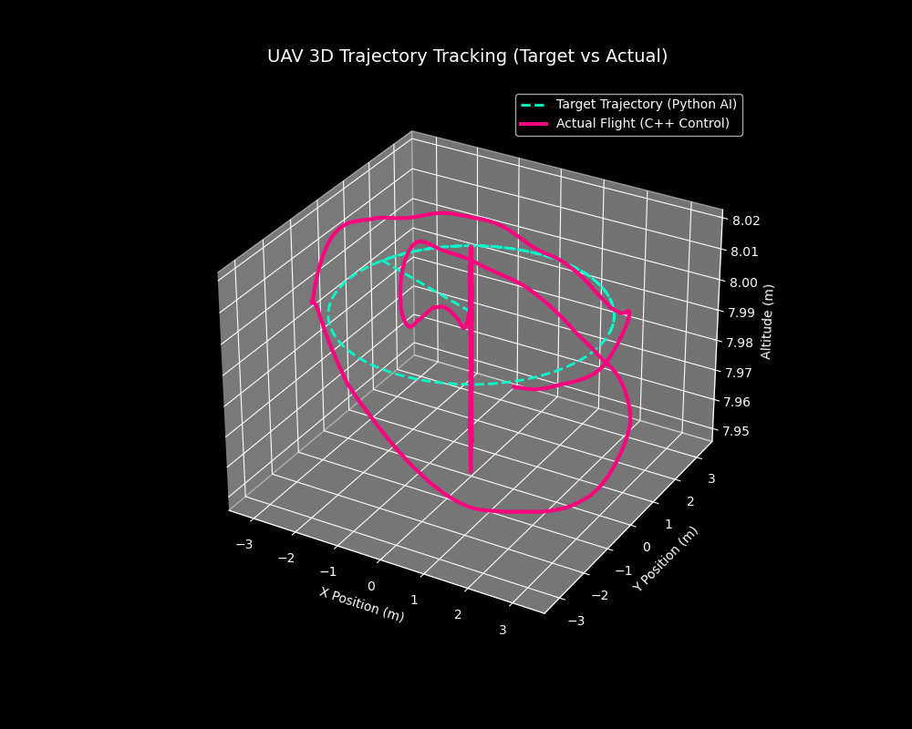

# 🛸 ROS2 Multi-UAV Trajectory Execution & Analysis System

### 基于 ROS 2 与 PX4 SITL 的多无人机轨迹控制与数据闭环验证系统

本项目是一个基于 **Ubuntu 24.04 + ROS 2 Jazzy + PX4 SITL + Gazebo** 的多无人机轨迹执行与仿真验证平台。系统采用 ROS 2 原生通信机制与 PX4 `px4_msgs` 接口，结合 **Micro XRCE-DDS** 运行环境，实现多架无人机在独立 namespace 下的 Offboard 位置 setpoint 控制、编队模式切换、轨迹平滑与仿真数据分析。

项目主要用于验证高层轨迹规划或编队指令在 PX4 SITL 物理仿真环境中的执行效果，为后续接入学习型轨迹预测、速度/加速度前馈或分布式 MPC 提供工程测试基础与 baseline。

---

## ✨ 核心工程特性 Core Features

### 🚀 1. ROS 2 多机 Namespace 隔离机制

项目通过 launch 文件批量启动多架无人机控制节点，每架无人机运行在独立 namespace 下，例如 `/px4_1`、`/px4_2`、`/px4_3` 等。相同 C++ 控制节点可复用于不同无人机实例，从而降低多机系统中的 topic 串扰与节点命名冲突风险。

### 🧠 2. PX4 Offboard 位置 Setpoint 控制链路

控制节点周期性向 PX4 发布 `OffboardControlMode` 与 `TrajectorySetpoint`，并通过 `VehicleCommand` 或 vehicle command service 完成解锁 Arming 与 Offboard 模式切换。系统当前聚焦于 Offboard 位置 setpoint 控制，C++ 节点负责上层 setpoint 生成、模式切换与轨迹平滑调度，底层位置环、姿态环、角速度环与电机控制由 PX4 内部控制器完成。

### 🔀 3. Python-C++ 解耦的编队状态机指令流水线

* **高层指挥端 Python**：作为全局集群指挥端，通过 `/swarm_command` 话题广播编队模式编号。
* **底层执行端 C++**：控制节点根据自身无人机 ID 计算对应的编队目标点，支持 Hover 悬停、Circle 环形轨迹、V-shape V 字形编队、Line 一字形编队，并预留上层 AI trajectory interface。

这种设计将编队指令生成与底层飞控接口解耦，使上层算法可以通过统一接口接入，而底层执行节点负责与 PX4 进行稳定交互。

### 🛡️ 4. 一阶低通滤波轨迹平滑策略

针对阵型切换或指令突变导致的目标 setpoint 跳变问题，C++ 执行端在目标点发布前加入离散一阶低通滤波器：

$$
p_{\text{smooth}}[k] = \alpha \cdot p_{\text{target}}[k] + (1 - \alpha) \cdot p_{\text{smooth}}[k-1]
$$

该方法以较低计算开销提升 setpoint 连续性，降低目标突变带来的跟踪过冲、姿态响应突变与轨迹抖动风险，使编队切换过程更加平滑。

### 📊 5. 仿真数据采集与轨迹分析

系统支持结合 PX4 odometry 数据、`rosbag2` 录包文件或仿真日志，对期望轨迹与实际执行轨迹进行离线量化分析。目前已完成 5 机集群起飞、悬停、环形轨迹与 V 字形编队切换验证，并基于仿真数据完成三维轨迹可视化与误差统计。

---

## 📊 性能量化与物理瓶颈分析 Evaluation & Insights

在 2 m/s 环形轨迹测试中，系统完成了多机轨迹跟踪与编队切换实验。根据离线轨迹分析，得到以下量化指标：

| Metric                  |       Value | Interpretation                  |
| ----------------------- | ----------: | ------------------------------- |
| **Max transient error** | **3.461 m** | 主要出现在起飞、初始变阵或目标点快速变化阶段          |
| **Steady-state RMSE**   | **1.536 m** | 反映纯位置 setpoint 跟踪与低通滤波平滑之间的动态折中 |



> 图例说明：青色虚线为期望轨迹，粉色实线为仿真环境中 PX4 执行后的实际运动轨迹。请将 `Figure_1.png` 放置在仓库根目录下。

### 🔬 核心工程见解 Engineering Insights

`1.536 m` 的稳态 RMSE 反映了 **“一阶低通滤波 + 纯位置 setpoint 跟踪”架构下平滑性与响应速度之间的动态折中**。低通滤波器可以抑制目标点突变，但其本质上会引入一定时域滞后。在高速轨迹跟踪场景中，该滞后会表现为空间轨迹上的相位偏差。

这一结果为后续引入速度/加速度前馈、带时间戳的轨迹序列、轨迹连续性约束或分布式 MPC 提供了可量化的 baseline。

---

## 📂 Project Structure

```text
px4_swarm_controller/
├── launch/
│   └── launch_simulation.py          # 批量启动多机控制节点并分配 namespace
├── src/
│   ├── circle_flight.cpp             # 编队目标生成、Offboard setpoint 发布与低通平滑
│   ├── Arming.cpp                    # 多机自动解锁与 Offboard 模式切换封装
│   ├── ChangeWaypoint.cpp            # 航点切换逻辑
│   └── SwarmControllers/
│       └── WeightedTopology/         # 加权拓扑集群协同控制模块
├── config/
│   ├── gains.yaml                    # 控制增益参数
│   ├── swarm_config.json             # 集群与仿真配置
│   └── Trajectories/                 # 预设航点与轨迹配置
└── custom_msgs/
    └── msg/                          # 编队目标与轨迹相关自定义消息接口
```

---

## 🛠️ 技术栈 Tech Stack

* **OS**: Ubuntu 24.04 LTS
* **Middleware**: ROS 2 Jazzy, Micro XRCE-DDS Agent
* **Flight Controller**: PX4 Autopilot SITL
* **Simulation**: Gazebo
* **Language**: C++, Python
* **Data Analysis**: rosbag2, pandas, matplotlib, numpy

---

## ⚙️ 环境依赖与快速复现 Quick Start

本项目为多节点分布式集群系统，编译完成后需依次启动通信代理、PX4 多机仿真环境、ROS 2 控制节点与交互指挥端。

### 1. 编译工作空间

```bash
cd ~/ros2_ws
colcon build --packages-select custom_msgs px4_swarm_controller
source install/local_setup.bash
```

### 2. 启动 Micro XRCE-DDS Agent

```bash
MicroXRCEAgent udp4 -p 8888
```

### 3. 启动 PX4 多机 SITL 仿真环境

```bash
cd ~/PX4-Autopilot
./start_swarm.sh
```

### 4. 启动 ROS 2 多机控制节点

```bash
ros2 launch px4_swarm_controller launch_simulation.py
```

### 5. 运行交互指挥端

```bash
python3 swarm_commander.py
```

---

## 🔮 系统边界与技术演进 System Boundary & Future Work

* **控制边界**：当前系统主要采用 PX4 Offboard 位置 setpoint 控制，底层位置环、姿态环、角速度环与电机执行由 PX4 内部控制器完成。
* **轨迹接口扩展**：上层 AI trajectory interface 当前以目标点输入为主，后续可扩展为带时间戳的连续轨迹序列或 B-spline 控制点。
* **动态跟踪优化**：一阶低通滤波提升了 setpoint 平滑性，但会引入相位滞后，后续可在 C++ 执行端引入速度/加速度前馈机制，提前补偿飞行器动态响应延迟。
* **集群约束优化**：当前编队模式以几何队形切换为主，后续可引入在线避障、最小间距约束和分布式模型预测控制 Distributed MPC，进一步提升复杂场景下的安全性与轨迹跟踪性能。
